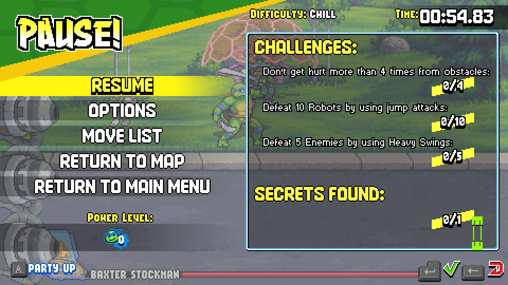
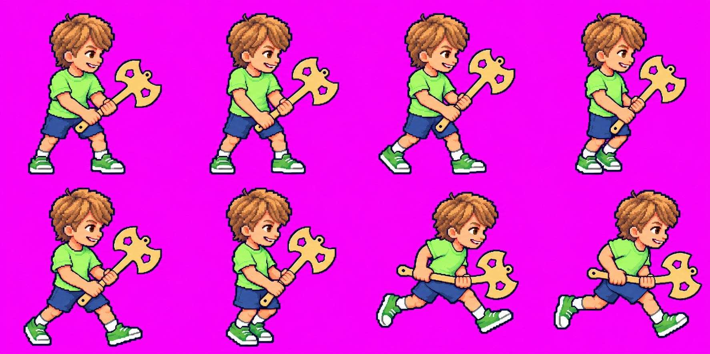
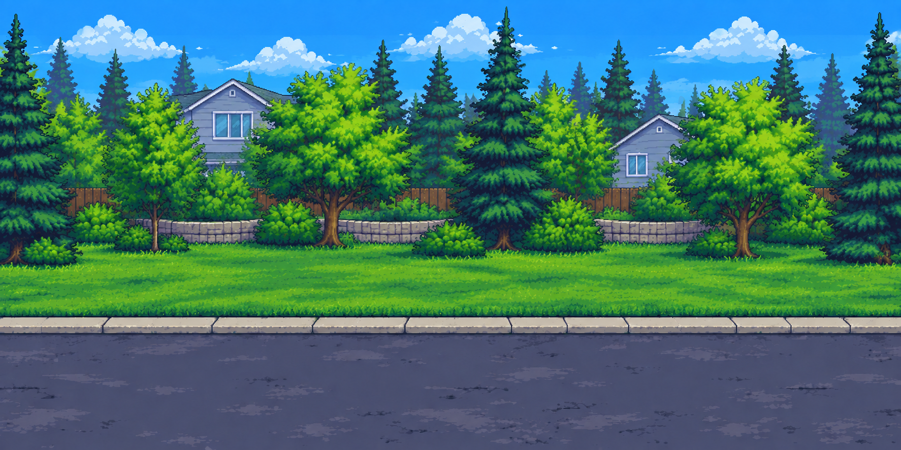

# TMNT: Malcolm's Revenge

A new-level mod project for the Steam edition of Teenage Mutant Ninja Turtles: Shredder's Revenge, with a reusable AI-assisted sprite pipeline.

**Use with Codex or Claude Code:** clone this repository and open its root in your agent. [AGENTS.md](AGENTS.md) and [CLAUDE.md](CLAUDE.md) load the shared instructions and bundled workflow—no separate skill installation needed. See [agent quick start](docs/agent-quickstart.md) for example prompts and prerequisites.

**Use the workflow outside this repo:** optionally install the [TMNT modding skill](docs/reusable-skill.md). It covers setup, the framework, photo-based characters, animation, Maps route planning, level integration, tests and rollback. The [entrypoint](skills/tmnt-shredders-revenge/SKILL.md) distinguishes working adapters from extensions still to implement.

The [reusable workflow index](docs/workflows.md) links inspection, runtime builds, playtesting, encounters, backgrounds, and character creation. The [character authoring guide](docs/adding-characters.md) records the complete Malcolm process, including generation corrections, manifest authoring, native integration, and verification.

**Status:** a summer suburban level prototype renders generated house, street, and park backgrounds in an isolated playtest using the native Baxter stage. Live logs confirm scene redirection, background rendering, and progression into the native boss fight. Combat gating and boss victory remain under verification. Malcolm's original character pack, native contract exporter, manifest validator/preview, and optional Leo-slot renderer are implemented; see [character verification](docs/character-verification.md) for completed checks and remaining visual review.

See [summer prototype verification](docs/residential-verification.md), [background workflow](docs/background-pipeline.md), and [continuous Street View route generation issue](https://github.com/wmtaff/tmnt-malcolms-revenge/issues/1).

The [custom playable character plan](docs/custom-player-plan.md) separates the current existing-slot appearance prototype from bespoke animation refinement and a future independent roster identity.

See [runtime build and launch instructions](docs/runtime-build.md) and [verification evidence](docs/runtime-verification.md).

The [configurable three-wave encounter](docs/encounter-prototype.md) is now verified in live Episode 1 gameplay, with [Start/Status/Stop controls](docs/playtest-controls.md). Logs confirmed all three configured enemy positions and progression into the unchanged fourth native wave; the user defeated the first three enemies. This is an encounter prototype inside the existing episode, not a complete custom level.

## Screenshots



Saved playtest capture: generated summer park scenery in the native Baxter encounter, paused. [More screenshots and capture notes](docs/screenshots.md). A clean screenshot of Malcolm's corrected appearance is still needed.

## Artwork previews

### Malcolm movement sheet



Generated poses for Malcolm's custom character pack. See the [character authoring workflow](docs/adding-characters.md) for animation and game integration.

### Summer suburban street



Generated scenery for the summer residential route prototype. See the [background workflow](docs/background-pipeline.md) for reference-based generation and repeat previews. Continuous address-to-address Street View reconstruction remains planned work. These images are source artwork previews, not gameplay captures.

## Quick start

Python 3.11 or newer is required. From the repository/worktree root:

```powershell
python -m venv .venv
.venv/Scripts/python -m pip install -e .
.venv/Scripts/python -m unittest discover -s tests -v
.venv/Scripts/python -m tmnt_mod inspect-game 'D:/SteamLibrary/steamapps/common/TMNT'
.venv/Scripts/python -m tmnt_mod inventory-assets 'C:/path/to/visual_assets.zip'
.venv/Scripts/python -m tmnt_mod validate-sprite 'C:/path/to/boss.png' --width 128 --height 128 --max-colors 64
```

On Linux/macOS use `.venv/bin/python`. Dimensions and palette limits above are examples, not verified TMNT constraints.

Commands print JSON to standard output. Exit status is 0 for successful reports, 1 for failed validation/unsafe archive paths/invalid installation evidence, and 2 for input or operational errors. Argument syntax errors use argparse's standard error output. Redirect output into an ignored `artifacts/` directory to save reports.

The game inspector hashes required assemblies and inspects compressed stage-data strings with bounded decompression. It does not execute game code or deserialize a complete level. The ZIP inventory does not extract or decode the entire archive. Sprite validation inspects pixels without modifying them and accepts individual frames up to 1,048,576 pixels (1024x1024 area); larger images are rejected before pixel processing. Split large sheets into frames before validation. Passing checks does not establish visual quality or game compatibility. Palette counts include distinct visible RGBA values; fully transparent pixels are excluded.

## Development approach

Use an integration worktree and separate branches for independent agent tasks. Each implementer owns explicit files, writes behavioral tests with synthetic assets, and submits a commit for independent review before integration. Keep source game assets and credentials out of Git. Do not auto-install historic mod-loader binaries into Steam: establish compatibility first.

The proposed generation pipeline is reference design -> controlled poses -> short frame sequences -> validation and manual review -> game-specific export. Providers remain replaceable. Benchmark OpenAI, PixelLab, and optionally Retro Diffusion on the same boss and idle/walk/attack/hurt sequences; compare native-size style, identity, attack readability, correction effort, and cost per accepted animation.

See [design and research](docs/design.md) and [implementation plan](docs/superpowers/plans/2026-09-08-foundations.md).
