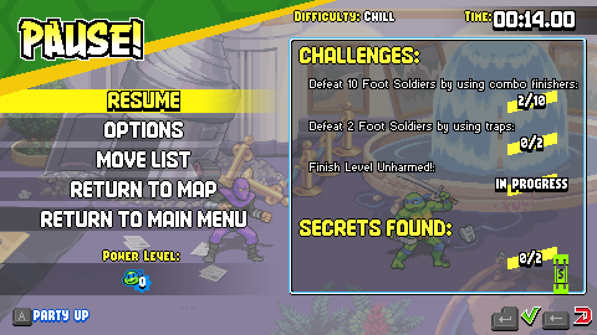

# Saved playtest screenshots

These are actual game captures from September 8, 2026, converted losslessly from BMP to PNG for GitHub. The pause overlays are part of the original captures. No scene elements were added, removed or retouched. [Provenance](images/provenance.json) records dimensions, source hashes and published image hashes.

## Suburban background and Baxter encounter

The generated summer park scenery is visible behind the pause menu, with the native Baxter Stockman health bar at the bottom. This captures the residential prototype during the boss encounter; it does not demonstrate boss victory or continuous address-to-address reconstruction. See [residential verification](residential-verification.md).

## Episode 1 encounter prototype

This is the earlier encounter prototype with native Leonardo artwork. The image documents the running game; the configured wave changes are supported by the separate logs and user feedback in [encounter verification](encounter-prototype.md).

## Character capture still needed

The saved Malcolm-session captures show either the earlier name-only/Leo-art bug or a game-over screen. They are not presented as screenshots of the corrected custom character. The user later confirmed Malcolm appeared, but a clean selection/gameplay capture should be added in a future playtest. [Character verification](character-verification.md) separates those observations.

The [Malcolm movement sheet](../art/characters/malcolm/movement.png) and [summer street artwork](../art/backgrounds/residential/street.png) are also available as original generated assets; they are not gameplay screenshots.
